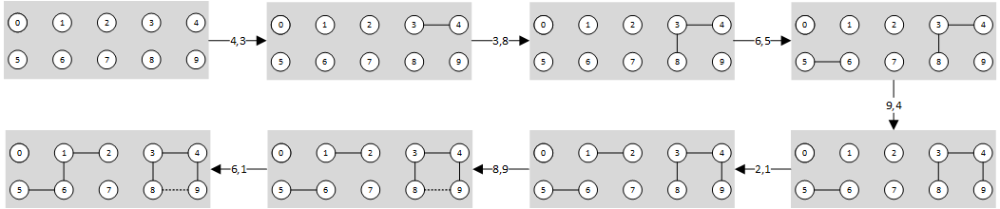
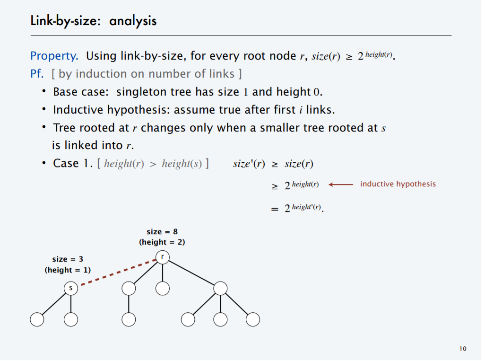
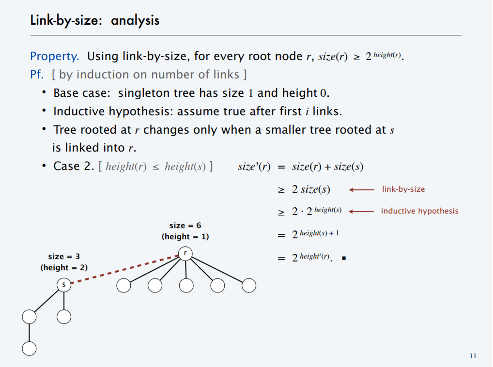
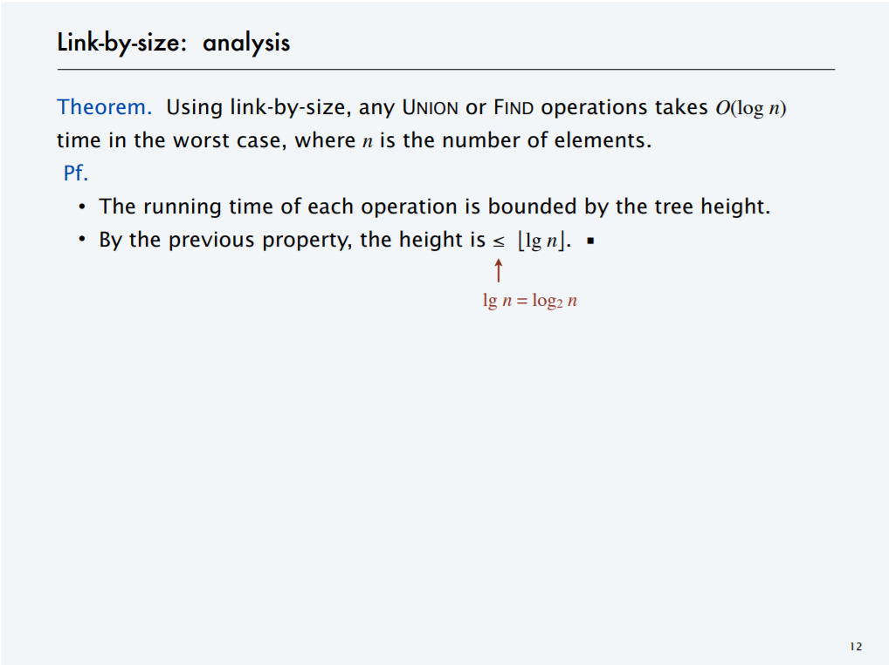

# union_find算法进化 


## 1. Question

有这样一个问题，A与B是亲戚，B与C也是亲戚，D与E是亲戚，E与F也是亲戚，我们可以看到ABC是同一波家族，而DEF是另一波家族。那么当人数变多的时候，如全中国，这个时候我们无法很快的知道，哪些人是同个家族，哪两个人是亲戚关系了。


## 2. Model
我们先化繁为简，假设有10个人，然后每个人给一个数字编号id(0-9)，有亲戚关系的两两一组数据对作为输入，用直连连接着两个点，但当发现输入的两个点已经同属一个组了我们就不连接，最终得到一张图，可能是连通图（全部人都是亲戚），也可能只是具有多个连通分量的图（多个家族），但其实只是连通分量的数量问题，前者为1个连通分量，后者为n个连通分量，都可以当做一种情况处理，下面的演变过程：



可以清晰的看到，顺着箭头方向，每次输入一个数据对，我们都用实现相连，除了(8,9)这个例外，因为已经连通了，我们给予了虚线，最终得出两个连通分量，即两个家族。


## 3. Implement

上述的要点在于`当发现输入的两个点已经同属一个组了我们就不连接`，这里拆解为两个动作，一个是判断两个点是否已经连通，另一个则是合并两个已经连通的点。那么如何知道两个点是否早已连通呢，可以通过找出这两个点分别归属哪个组来解决，同组则连通，而合并的意思则是将两个点的组别设置成同个组，用api来表示分别就是find以及union。


### 3.1 Quick-find

好了为了实现这两个关键的api，我们需要选择一种数据结构，那么哪种结构能让我们快速的找到一个点的组别呢，首先选择数组，读取元素值的复杂度为O(1)。

首先初始化一个size为N的数组，每个id对应的组号是它们自己，因为一开始还不知道谁是谁，能确定的一点是自己跟自己是亲戚（即连通），这也是一个基本概念:
```cpp
for (int i=0; i < N; ++i) {
  id[i] = i;
}
```

对于find的实现也是极其简单，每个id指向的即是自己的组别:
```cpp
int find(int p)
{
  return id[p]; // 确实很quick
}
```

union的实现也很直白，就是判断两个点(p,q)是否已经连通，不连通则遍历整个数组，将p所在的组别改为q所在的组别（或者相反亦可）:
```cpp
public void union(int p, int q)
{
  int pID = find(p);
  int qID = find(q);

  for (int i = 0; i < id.length; i++) {
    if (id[i] == pID) 
      id[i] = qID;
  }
  
}
```

union跟find都有了，剩下就是边读入两两的数据对，边find是否连通，不连通则union两个点，最终获得一张图，然后我们就可以轻松的判断两点是否连通了，当然如果你想计算有多少个连通分量（多少个家族），可以增加count变量，初始化为N，在每一次union之后减一（每次合并两个点都会使得连通分量减一），最终就是连通分量的个数了。

### 3.2 Quick-union

quick-find在功能上没有问题，但是在效率上需要优化，我们看到每次union都要遍历数组，假设你有M个数据对，而数组size为N，意味着算法复杂度趋向于平方级别，怎么优化呢，数据对输入就那么多，没法动了，那只能拿union开刀了，能不能将合并操作优化得不那么线性呢？

我们重新审视union的作用，即将某个id的组别修改为另外一个组别，那我们是怎么归类组别的呢，对于同组的id都将设置为同个组别，这个特性貌似符合二叉树，每个组即一个树，其子节点都同属于root节点，如果是树结构，那么我们只需要修改root节点即可，其实就是一个合并树的过程，无需遍历了，但是find就要比之前耗时些了。

find的实现:
```cpp
int find(int p)
{
  while (p != id[p]) p = id[p]; // 一直往root节点回溯，直到找到为止
  return p;
}
```

union的实现:
```cpp
public void union(int p, int q)
{
  int pID = find(p);
  int qID = find(q);

  id[pID] = qID; // quick-union
}
```

我们很清晰的看到，现在的瓶颈出现在find操作中，但是没有之前的那么差，现在的find复杂度是取决于树的高度，越高的数它想回溯到root节点就越慢，而树高是由数据决定的，如果输入的数据是有序的，如(0,1)(0,2)(0,3)(0,4)...，按照现在的union，会演变成这样一颗树0->1->2->3->4...，其实就是个链表了，此时树高为(N-1)，那又回到了解放前啊，平方级别的复杂度， 所以我们要控制好树的高度，怎么控制呢？


### 3.3 Quick-union-by-size

怎么控制数的高度呢，我们看到union的关键步骤`id[pID] = qID`，每次都是不分青红皂白地往qID上面添加树，如果此时qID的树比较小而pID的树比较大呢，那么合并后又更大了，正确的做法应该是将小树挂到大树上，这样就能保证数的高度了，那么怎么计算树的大小？

初始化一个存放树大小的数组:
```cpp
for (int i = 0; i < N; i++)
  sz[i] = 1;
```

union的改进，合并前判断树的大小:
```cpp
public void union(int p, int q)
{
  int pID = find(p);
  int qID = find(q);
  
  if (sz[pID] < sz[qID]) { 
    id[pID] = qID; 
    sz[qID] += sz[pID]; 
  }
  else { 
    id[qID] = pID; 
    sz[pID] += sz[qID];
  }

}
```

等等，说好的高度呢，为什么这里用的是size？其实也有用height的算法，也不难，也是用一个独立的数组记录每棵树的height，初始为0:

```cpp
for (int i = 0; i < N; i++)
  hg[i] = 0;
```
对应的union也要做修改，在height相等时增加一个高度，因为高度不等时，总以高的树为基准，只有相等时才需加一:
```cpp
public void union(int p, int q)
{
  int pID = find(p);
  int qID = find(q);
  
  if (hg[pID] < hg[qID]) { 
    id[pID] = qID; 
  }
  else if (hg[pID] > hg[qID])  { 
    id[qID] = pID; 
  }
  else {
    id[pID] = qID;
    hg[qID]++; // 挂了颗树，高度增一，因为挂完后一定比之前多了条边..
  }

}
```

若是by height进行组织的，我们看到两颗树的高度差始终不超过1，其实就是平衡二叉树了，而平衡二叉树的高度不超过lgn，也就是说find的复杂度为O(lgn)。那么为什么by size也是可行的呢？以下是[引用](https://www.cs.princeton.edu/courses/archive/spring13/cos423/lectures/UnionFind.pdf)的数学归纳法证明过程:

1\) 先假设`size(r)>=2^height(r)`，然后当size为1时height为0，成立，接着证明`size'(r)>=2^height'(r)`，成立则归纳成功，这里的`size'(r)`表示合并之后的树大小



2\) 验证另外一个条件，重点在于`height'(r)=height(s)+1`,就是我们上面说过的，挂了一颗树，高度会加一



3\) 结论




### 3.4 Weight-quick-union-with-compression

OK，3.3的算法已经是MlgN级别的复杂度了，那么有没有办法再优化呢？主要还是find操作需要优化，我们再次思考需求，我们只需要知道某个id的root节点是哪个即可，而无需知道它到root的具体路径，所以能不能压缩整颗树，让高度趋于1，也就是每个id只需一步即可找到root节点呢？

我们只需在回溯root节点的时候，顺便将当前节点p的父节点设置为p的爷爷节点，就这样一层层的往上挂:
```cpp
private int find(int p)
{
  while (p != id[p])
  {
    id[p] = id[id[p]]; // p->father = p->father->father 
    p = id[p];
  }
  return p;
}
```

最终的树将会是一颗趋于扁平的树，复杂度趋于O(1)，当然是无限的趋于，不会真的就是O(1)，但也比3.3的版本要强些了，所以最终的整体复杂度将是趋于O(N)，这也是以丢失路径信息为代价的。


