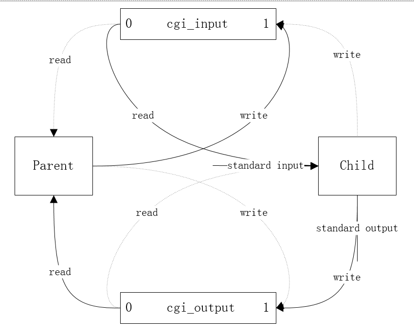

# tinyhttpd源码解读

## 1. OverView

tinyhttpd是一个小巧的http-server，[源码](https://sourceforge.net/projects/tinyhttpd/)不到500行，就实现了`GET/POST`方法以及`CGI`，用来窥探http-server的原理再好不过了。

## 2. Knowledge

下面是一些源码解读前的需要的知识，先了解，然后再来看tinyhttpd是怎么一一实现它们的。

### 2.1 HTTP

一个标准的http请求：
```
GET /something?who=finch HTTP/1.1
User-Agent: curl/7.29.0
Host: 127.0.0.1
Accept: */*
```
我们可以看到第一行是是`method`、`url`以及`http版本`，接下来的就是各种请求header以及对应的值，行与行之间用`CRLF`隔开，`CRLF`根据标准就是`\r\n`。

这是一个`GET`方法的请求，那如果是`POST`方法的请求，一般会在请求头之后加上请求体，也就是body，一般与headers之间用CRLF隔开。

### 2.2 CGI

Common Gateway Interface/CGI，通用网关接口，可以说是一个标准，而我们平时说的CGI其实指代一个程序，一个处理用户请求的程序，当用户请求到http-server时，http-server发起了一个CGI程序来处理这个请求，通常是与数据库打交道或者其它http-server本身比较难处理的，也就是说CGI拓展了http-server的能力，你可以使用任何语言编写CGI程序，前提是满足接口的标准。

所以CGI其实定义了http-server与处理程序之间的数据交流方式，怎么交流的呢，http-server通过`环境变量`来给cgi传输数据，如`query-string`，当然这只是在传输数据量较少的情况，如果是POST一个file这种情况怎么办呢？在linux下通过管道来处理，管道用来传递http-server与cgi之间的数据，然后cgi将自己的管道重定向为标准输入以及标准输出，使得cgi可以通过标准输入获得http-server的数据传入，通过标准输出来向http-server输出数据，详细的原理在源码阶段会再做剖析。

为什么要用标准输入输出呢？因为[标准](https://tools.ietf.org/html/rfc3875)（4.2&&6.1）就是这么定义的，我想是为了方便吧:)

## 3. Source 

先从`main`函数开始看起：
```cpp
...
server_sock = startup(&port);
...
while (1) {
  client_sock = accept(server_sock, (struct sockaddr *)&client_name, &client_name_len);
  if (client_sock == -1)
    error_die("accept");
    
  /* accept_request(&client_sock); */
  if (pthread_create(&newthread , NULL, (void *)accept_request, (void *)(intptr_t)client_sock) != 0)
    perror("pthread_create");
}
...
```
以上是启动的逻辑，当然只列出了关键部分，我们可以看到首先是生成了一个`socket`，然后开始循环处理，一有请求被`accept`，就`pthread_create`出一条线程去单独处理这个请求，显然这是个可以处理多个请求的http-server，当然会被系统的thread数量限制住，那么如何处理并发是另外一个话题了，我们先关注怎么样简单的处理一个http的请求。

接下来我们关注到`startup`函数，这个返回了一个`socket`的函数，其实里面就是`bind`一下地址，然后`listen`一下端口，没什么好讲了，就不贴代码了。

重点在于`accept_request`，也就是如何处理一个http请求，结合之前的http请求示例，我们知道首先要把`method`给读进来：
```cpp
numchars = get_line(client, buf, sizeof(buf));
i = 0; j = 0;
while (!ISspace(buf[i]) && (i < sizeof(method) - 1)) {
  method[i] = buf[i];
  i++;
}
j=i;
method[i] = '\0';
```
当然读的时候要忽略空格，好了，我们拿到了`method`，接下来开始判断，是`GET`或者是`POST`（tinyhttpd只实现这两个方法），都不是则返回`unimplemented`（501）：
```cpp
if (strcasecmp(method, "GET") && strcasecmp(method, "POST")) {
  unimplemented(client);
  return;
}
```
tinyhttpd将`POST`以及带有参数的`GET`访问都转向cgi程序处理，当然这不是标准，只是它的一种处理，还有一种的情况是client请求了一个可执行的文件，tinyhttpd也是将其转向cgi服务：
```cpp
if (strcasecmp(method, "POST") == 0)
  cgi = 1;
...
if (strcasecmp(method, "GET") == 0) {
  ...
  if (*query_string == '?'){
    ...
    cgi = 1;
  }
}
...
if ( (st.st_mode & S_IXUSR) || (st.st_mode & S_IXGRP) || (st.st_mode & S_IXOTH) )
  cgi = 1;
...
```

匹配完`method`，紧跟着当然是读取`url`了，当然也包含了`query_string`，如果是`GET`方法的话，也就是`?`后面那一串：
```cpp
while (!ISspace(buf[j]) && (i < sizeof(url) - 1) && (j < numchars)){
  url[i] = buf[j];
  i++; j++;
}
url[i] = '\0';

if (strcasecmp(method, "GET") == 0){
  query_string = url;
  while ((*query_string != '?') && (*query_string != '\0'))
    query_string++;
  ...
}
```

那么http-server是会存在一个根目录的，用于用户请求时默认的搜索目录，tinyhttpd这里定义为`htdocs`，所以我们需要将`url`与`htdocs`进行拼接，再去进行文件存在与否的判断，不存在则返回`not_found`（404），当`url`是'/'时，默认给予htdocs/index.html的内容给客户端：
```cpp
sprintf(path, "htdocs%s", url);
if (path[strlen(path) - 1] == '/')
  strcat(path, "index.html");
if (stat(path, &st) == -1) {
  while ((numchars > 0) && strcmp("\n", buf))  /* read & discard headers */
    numchars = get_line(client, buf, sizeof(buf));
    not_found(client);
}
```
我们注意到还有一段`read & discard headers`的操作，目的就是彻底接收完client的请求头，并丢弃，因为没用，为什么需要读取完所有的请求头？可以说请求头是客户端的要求所在，server不读完并不能知道client的明确需求，所以必须读完后才能reponse。

我们发现在最终的临界值比较时，它用的是`strcmp("\n", buf)`，按照标准来说应该`\r\n`才对呀，真相是部分client并没有按照标准，而是使用`\n`，所以tinyhttpd将两者兼容起来了（在get_line中），全部统一成`\n`：
```cpp
if (c == '\r'){
  n = recv(sock, &c, 1, MSG_PEEK); // MSG_PEEK,表示预读，不删除缓冲区的内容
  if ((n > 0) && (c == '\n'))
    recv(sock, &c, 1, 0);
  else
    c = '\n';
}
```

来到最后的分水岭，是cgi就给`execute_cgi`，否则就给`serve_file`：
```cpp
if (!cgi)
  serve_file(client, path);
else
  execute_cgi(client, path, method, query_string);
```

我们先来看`serve_file`，如果找不到文件则返回`not_found`，否则先给client发送headers，继而才是文件的内容，这也是一个标准，必须先发header，然后才是body，当然还是要读完所有的请求头并丢弃：
```cpp
buf[0] = 'A'; buf[1] = '\0'; // 这里是一个trick，保证下面的while首次会通过
while ((numchars > 0) && strcmp("\n", buf))  /* read & discard headers */
  numchars = get_line(client, buf, sizeof(buf));

resource = fopen(filename, "r");
if (resource == NULL)
  not_found(client);
else {
  headers(client, filename);
  cat(client, resource);
}
```

抵达传说中的cgi处理流程`execute_cgi`,我们看到如果是`POST`请求的话，就要读取`Content-Length`头，这个表示request-body的长度，单位bytes，如果没有这个头部的话，那就是bad request（400）：
```cpp
else if (strcasecmp(method, "POST") == 0) /*POST*/{
  numchars = get_line(client, buf, sizeof(buf));
  while ((numchars > 0) && strcmp("\n", buf)){
    buf[15] = '\0';
    if (strcasecmp(buf, "Content-Length:") == 0) 
      content_length = atoi(&(buf[16]));
      numchars = get_line(client, buf, sizeof(buf));
  }
  if (content_length == -1) {
    bad_request(client);
    return;
  }
}
```
接下来就要fork一个子进程去运行cgi程序了，然后创建管道，用于子进程与server之间的数据传输，管道的原理我们后面在讲，我们先来看子进程中的处理：
```cpp
if (pid == 0)  /* child: CGI script */ {
  ...
  sprintf(meth_env, "REQUEST_METHOD=%s", method);
  putenv(meth_env);
  if (strcasecmp(method, "GET") == 0) {
      sprintf(query_env, "QUERY_STRING=%s", query_string);
      putenv(query_env);
  }
  else {   /* POST */
      sprintf(length_env, "CONTENT_LENGTH=%d", content_length);
      putenv(length_env);
  }
  execl(path, NULL);
  ...
}
```
可以看到，设置了几个环境变量，跟我们之前讲过的CGI标准吻合，最后`execl`执行cgi程序，那么父进程需要做些什么：
```cpp
else {    /* parent */
  ...
  if (strcasecmp(method, "POST") == 0)
    for (i = 0; i < content_length; i++) {
      recv(client, &c, 1, 0);
      write(cgi_input[1], &c, 1);
    }
  while (read(cgi_output[0], &c, 1) > 0)
    send(client, &c, 1, 0);

  ...
  waitpid(pid, &status, 0);
}
```
在server中，如果是`POST`方法，那么读取`Content-Length`长度的body，通过管道传输给cgi程序，并在管道等到cgi程序的数据返回，拿到数据后，server直接发送给了client，并回收子进程。

最后来了解下里面用到的管道，看着有点头大，可读性比较差：
```cpp
// 子进程（cgi）
if (pid == 0)  {
  char meth_env[255];
  char query_env[255];
  char length_env[255];

  dup2(cgi_output[1], STDOUT);
  dup2(cgi_input[0], STDIN);
  close(cgi_output[0]);
  close(cgi_input[1]);
  ...
}
// 父进程（server）
esle {
  close(cgi_output[1]);
  close(cgi_input[0]);
  ...
}
```
很好，初次看不知道干了啥，只知道子进程中有重定向，到标准输入输出，那么子进程与父进程是怎么建立起通信管道的呢？为什么要用两个管道呢？

首先要知道，linux的管道不是双工的，意味着只能单向通信，所以要实现双向的通信，就需要建两个管道了，那怎么建？看图说话：



每个管道两个文件描述符（0,1），0表示read，1表示write，虚线表示被close掉的部分，最终就是双向通信了，注意到Child进程这边做了重定向处理，这样就可以从标准输入读取到server给它的数据，然后由标准输出将数据给到server。

虽然理清楚了，但这可读性...我们可以使用[socketpair](https://www.ibm.com/developerworks/cn/linux/l-pipebid/index.html)来实现通信功能，由于是socket，所以原生支持全双工通信，只需要两个fd而不是上面的四个fd了。

