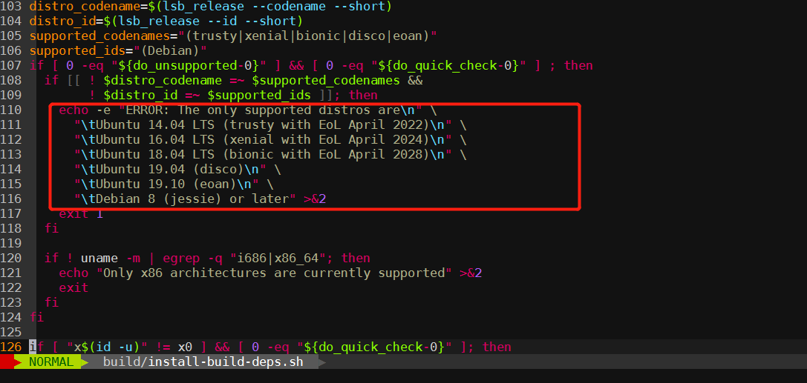

# Webrtc编译android aar库


## Prerequisite 

机器预留30GB的存储空间，最好选择CPU强劲的，我的是i7-6700, 16核心，编译一个abi也要5分钟。

需要翻墙才能够下载源码，最好是使用国外的云服务器，下载速度会比较快。

查阅编译脚本（src/build/install-build-deps.sh）可知目前支持的系统如下:



安装依赖:

```
 sudo add-apt-repository ppa:openjdk-r/ppa
 sudo apt-get install openjdk-8-jdk
 sudo apt-get install pkg-config
 sudo apt-get update
```

## Download 
### Download compile tools (about 1GB)
```sh
mkdir /opt/webrc && cd /opt/webrtc
git clone https://chromium.googlesource.com/chromium/tools/depot_tools.git
export PATH="$PATH:/opt/webrtc/depot_tools"

```

### Fetch source code (about 20GB)
```sh
mkdir webrtc_android && cd webrtc_android
fetch --nohooks webrtc_android
gclient sync
cd src/
./build/install-build-deps.sh
```

## Compile aar

### Checkout the specify branch (OPTION 2)

所有的正式版本可以在[这里](https://groups.google.com/g/discuss-webrtc/search?q=%20Release%20Notes)查找到。

选择你想要编译的版本分支，如想要编译m86, 查看得知分支是branch 4240，这里mXX是chromium的版本其实，因为webrtc是chromium的源码一部分。

src目录下执行，`gclient sync -D`的作用是重新拉取改分支的代码，并删除不在分支中的多余代码，是必要步骤
```sh
git checkout branch-heads/4240
cd ..
gclient sync -D
```

### Compile
打开`tools_webrtc/android/build_aar.py`找到这句定义`DEFAULT_ARCHS = ['armeabi-v7a', 'arm64-v8a', 'x86', 'x86_64']`,
可以增删自己想要的abi。

最后直接执行脚本编译即可, 编译完成后可以在当前目录看到`libwebrtc.aar`
```sh
cd src
./tools_webrtc/android/build_aar.py
```

### Issue
* 执行`gclient sync`提示`Running depot tools as root is sad.`，解决方法就是修改depot_tools/update_depot_tools文件，注释掉root的判断即可

* 编译时提示`clang: error while loading shared libraries: libtinfo.so.5: cannot open shared object file: No such file or directory`，
安装对应的库即可`sudo apt install libncurses5`

